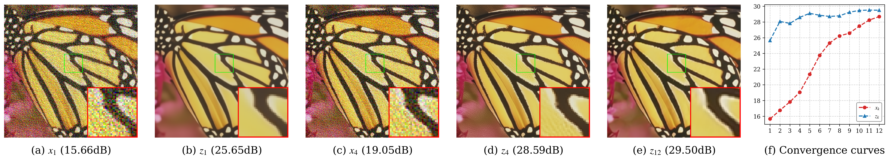

# How Blur Kernels Shape Optimal HQS Trajectories in Plug-and-Play Image Restoration

[](https://pytorch.org/)
[](LICENSE)

Official PyTorch implementation of the paper: **"How Blur Kernels Shape Optimal HQS Trajectories in Plug-and-Play Image Restoration"**.

---

## 📌 Overview

Traditional Plug-and-Play Half-Quadratic Splitting (PnP-HQS) methods typically apply a single, hand-crafted schedule for penalty parameter ($\mu_k$) and noise level ($\sigma_k$) across all blur degradations. However, this universal approach is suboptimal because real-world blur kernels exhibit vast diversity in scale, shape, and topology.

In this work, we **freeze the weights of the pre-trained deep denoiser (DRUNet) entirely** and formulate the $T=12$ iterations of the HQS hyperparameters ($\mu_k$, $\sigma_k$) as learnable parameters. By training them end-to-end via **differentiable unrolling**, we discover:
1. **Divergent Trajectory Patterns**: The optimal trajectories diverge from the hand-crafted schedule into distinct, interpretable patterns governed by the blur's shape (Gaussian vs. non-Gaussian), scale, and motion path topology (open-loop vs. closed-loop).
2. **Improved Restoration**: This kernel-adaptive optimization yields an average PSNR improvement of **0.12 dB** on the Set3C dataset without touching the denoiser's weights.

<div align="center">
  
  <p><i>Our kernel-specific schedule suppresses structured motion artifacts more cleanly than the hand-crafted baseline.</i></p>
</div>

---

## 📂 Repository Structure

```
├── models/
│   ├── network_unet.py          # DRUNet Architecture
│   └── basicblock.py            # Neural network blocks & operations
├── utils/
│   ├── utils_image.py           # Image handling & metric calculation (PSNR/SSIM)
│   ├── utils_sisr.py            # Closed-form data solution in FFT domain
│   ├── utils_model.py           # Model loading & evaluation modes
│   └── utils_pnp.py             # Baseline hand-crafted schedule generation
├── testsets/
│   └── set3c/                   # Set3C test images (butterfly, leaves, starfish)
├── viz_results/                 # Paper-ready generated figures (pdf & png)
├── train_trajectory.py          # HQS parameter trajectory training script
├── visualize_all.py             # Unified paper figures plotting script
├── all_trajectories.json        # Optimized hyperparameters for all 12 kernels
├── kernels_12.npy               # Predefined 12 blur kernels
├── index.html                   # Project webpage (Github Pages)
├── LICENSE                      # MIT License
└── README.md                    # This file
```

---

## 🛠️ Installation & Requirements

Ensure you have PyTorch and standard scientific computing tools installed:

```bash
pip install torch numpy scipy matplotlib opencv-python
```

### Pretrained Model Weights
To run training or visualize qualitative comparison plots, download the pretrained model weights and place them under `model_zoo/`:
* `model_zoo/drunet_color.pth`
* `model_zoo/drunet_color_baseline_model.pth`

---

## 🏃 How to Run

### 1. Train Kernel-Specific Trajectories
To run the differentiable unrolling optimization independently for the 12 blur kernels:
```bash
python train_trajectory.py
```
*Outputs will be saved in `trajectory_results/all_trajectories.json`.*

### 2. Generate All Paper-Ready Figures
To run the evaluation simulation on Set3C and generate all quantitative trajectory curves, blur kernels, and qualitative reconstruction figures:
```bash
python visualize_all.py
```
This single script generates the following files inside `viz_results/`:
* `figure2_kernels.{pdf,png}`: Visual representation of the 12 blur kernels.
* `figure4_grouped_trajectories.{pdf,png}`: Averaged trajectories per structural group.
* `paper_sigma_trajectories_3x4.{pdf,png}`: Non-averaged per-kernel noise level schedules.
* `paper_mu_trajectories_linear_3x4.{pdf,png}`: Non-averaged per-kernel penalty parameter schedules.
* `paper_qualitative_convergence_baseline.{pdf,png}`: Step-by-step restoration of baseline HQS.
* `paper_qualitative_convergence_ours.{pdf,png}`: Step-by-step restoration of our kernel-adaptive HQS.

---

## 📊 Quantitative Performance on Set3C

Average PSNR (dB) improvements on the Set3C dataset comparing the standard hand-crafted DPIR baseline with our learned kernel-specific schedules:

| Kernel Group | Kernel | Baseline | Ours | $\Delta$PSNR |
| :--- | :---: | :---: | :---: | :---: |
| **Gaussian (Small)** | Kernel 00 | 34.56 | 34.56 | $+0.00$ |
| | Kernel 01 | 29.93 | 30.04 | $+0.12$ |
| | Kernel 02 | 27.90 | 27.98 | $+0.08$ |
| **Gaussian (Large)** | Kernel 03 | 26.29 | 26.42 | $+0.13$ |
| | Kernel 04 | 25.90 | 26.05 | $+0.16$ |
| | Kernel 05 | 25.50 | 25.68 | $+0.18$ |
| | Kernel 06 | 26.13 | 26.27 | $+0.14$ |
| | Kernel 07 | 24.75 | 24.90 | $+0.16$ |
| **Non-Gaussian (Open)** | Kernel 08 | 29.72 | 29.89 | $+0.17$ |
| | Kernel 10 | 29.69 | 29.79 | $+0.10$ |
| **Non-Gaussian (Closed)**| Kernel 09 | 30.19 | 30.26 | $+0.07$ |
| | Kernel 11 | 28.74 | 28.82 | $+0.08$ |
| **Average** | | **28.27** | **28.39** | **+0.12** |

---

## ✍️ Citation

If you find our research or codebase helpful in your work, please consider citing:

```bibtex
@article{kim2026how,
  title={How Blur Kernels Shape Optimal HQS Trajectories in Plug-and-Play Image Restoration},
  author={Kim, Jongmin and Choi, Jaehyeok},
  journal={arXiv preprint},
  year={2026}
}
```
